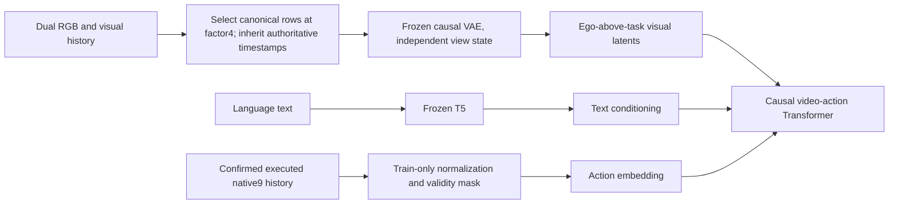

# Adaptation v2 overview

## Research objective and current position

Adapt pretrained LingBot-VA to language-conditioned Go2 quadrupedal manipulation with one FL manipulation leg and native RAMBO9D commands. The research target is a correctly trained checkpoint making stable synchronous closed-loop progress on the approved Push Box task using dual RGB/visual history and confirmed executed-action history.

Model adaptation foundations and the real simulation-to-data-to-cache path are validated. DATA-005's ten demonstrations were user accepted; DATA-006 now has50 usable demonstrations, complete Canonical/cache acceptance and no missing slots. No SFT checkpoint or learned-policy task-success result exists yet. QLM-Bench publication is DATA-007; its current status and fixed revision are in [publication policy](publication-v2.md).

## Fixed baseline

- Go2 quadruped, FL only; original RAMBO controller/checkpoint and native robot reset XY origin.
- Native9 order: base vx/vy/yaw rate, FL position xyz, desired FL force xyz. Desired force remains zero.
- Inputs: text, Go2 ego RGB, D435i task RGB, visual history and confirmed executed9D history. Telemetry/proprio/contact/observer remain diagnostic, not extra model inputs.
- Frozen VAE/T5, native9 projections and ego-above-task dual-view latent composition. First SFT baseline uses existing Transformer trainability policy; no OPD, LoRA-first redesign, proprio encoder or replacement controller.
- Raw/canonical RGB/actions50Hz; modelRGB12.5Hz; observer25Hz monitor-only; controller100Hz/physics500Hz. Factor4 selects rows; timestamps inherit authoritative canonical simulation_time_ns or terminal metadata, never frame-index synthesis.
- CanonicalN action rows/video frames plus separate pre-reset terminal state/two RGB PNGs; RawN+1 boundaries. No dummy terminal action. Preserve source tails; apply explicit initial masks/complete grouping only in derived model preprocessing.

## Conditioning paths and approval

Approach-and-Push Box is approved under DATA-004. Contact remains diagnostic/unknown and does not gate success. The following paths describe the accepted model/data interface; the learned-policy runtime connection remains unimplemented.

Observer, proprioception, telemetry and contact remain diagnostic. Model flow outputs require later sampling and execution integration; they are not physical commands.

## Responsibilities

WAM-Policy owns model conversion, data consumption, frozen preprocessing/cache, normalization, SFT, checkpoint recovery, inference and model evaluation. RAMBO_Data owns Isaac/controller/task/assets/cameras, scripted demonstrations, recording, task success and canonical publication. Exchange explicit contracts; no cross-repository implementation imports.

## Completed evidence and limits

| Work | Completed | Not established |
|---|---|---|
| INFRA-001/002 | Local workspace, source isolation, runtime foundations | Current v2 AMD runtime; historical OPD evidence is documented below |
| ALG-001 | Native9 conversion, dual-view VAE/T5, full-model T=9 forward/export/reload; small-model backward/single-process recovery | Full-model backward/optimizer, FSDP/distributed resume |
| DATA-001/002/003 | Runtime/data contracts, LeRobot50Hz storage, authoritative timestamps and terminal semantics | Learned-policy runtime integration |
| DATA-004 | Approved task/assets/cameras, original controller wiring, strict terminal-before-reset and valid straight full-footprint pilot | Old center-only pilot is invalid/excluded |
| DATA-005 | Three pilots followed by ten accepted small-XY demonstrations,8/1/1 split and actual frozen caches | Learned task success |
| DATA-006 | Fifty usable episodes,40/5/5 split, real frozen cache reload, train-only normalization and final data acceptance | Dataset sufficiency/generalization or SFT performance |

DATA-004 was previously committed/pushed. Later source publication is recorded by DATA-007's GitHub publication evidence; source HEADs alone do not identify uncommitted historical collection implementations. Each original run retains its actual source hashes.

## First adaptation training/evaluation task and data — Push Box

Success: full XY envelope of all eight pose-transformed source-box corners inside that episode's goal, robot not fallen, for three consecutive50Hz policy ticks. Roll/pitch are included in geometry. Contact is diagnostic/unknown, not a gate; residual yaw and natural box toppling are reported without inventing upright/contact/yaw success thresholds.

DATA-006 retains DATA-005's ten original files and8/1/1 split, and adds40 episodes with32/4/4 split. Total50 episodes and24,335 actions; train-only affine q01/q99 normalization uses19,340 actions, no clipping, constant dimension scale1, force offsets0/scales1. Validation/test do not affect fitting. VAE state resets per episode; frozen VAE/T5 encoding and cache reload passed on all50.

Added variations: Box05/01/04 counts20/10/10, yaw0/90/180/270 ten each, goal colors/geometry and coordinated/leg-finish/body-finish configuration counts14/13/13. Of13 leg-finish configurations,12 actually triggered the conditional finish phase. demo13/25 successful a4s include stop-forward/left-shift/inward-FL correction. demo11-a2 is valid; a1 is quarantined. Pilots, failures and quarantined attempts remain local and are excluded from usable Canonical and HF publication.

Evidence: workspace runs/audit/v2/DATA-006/20260916T075451Z/acceptance.json, collection-paths.json and collection-entries.json. Original per-episode Raw/canonical sources and source media are immutable. Final audit confirms all pre-reset terminals and inherited timestamps;26 core schema/profile and24 asset files plus original controller remain unchanged. No further collection is required to meet this50-episode scope.

## Next phase: discuss before implementation

The user intends to prepare training code, submission scripts/job orchestration for their AMD server and feasible local RTX5070Ti small-scale verification. Initial read-only context recovery is complete. DOC-002 corrected status and historical AMD evidence. The user subsequently authorized TRAIN-001 training implementation, administrator job orchestration and bounded local checks, without AMD connection/submission or commit/push.

TRAIN-001 now implements whole-episode sampling, a single/DDP training entrypoint, complete rank-specific data/RNG recovery, validation/logging and automatic administrator Slurm orchestration. See [training implementation](../../../WAM-Policy/docs/current/training-v2.md). Local CPU/Gloo and diagnostic GPU evidence are separate from target AMD acceptance. Full-model backward/optimizer and8-card recovery remain administrator smoke gates before automatic1000-step SFT; small-model results cannot substitute.

Historical AMD execution is now verified through the user-supplied W&B run and pinned OPD branch:8 visible MI355X GPUs, Slurm mi355x, Python3.12.3 and torch2.11.0.dev20260206+rocm7.0; recorded Stage1/Stage2 updates completed. See [historical AMD evidence](../../../WAM-Policy/docs/current/amd-training-reference.md) for source and final-evaluation metadata limitations. Current access/runtime/attention compatibility and full-Transformer v2 training/recovery remain unverified. Do not infer CUDA compatibility or import OPD behavior. No Adaptation v2 remote jobs, formal SFT or new collection have been started; TRAIN-001 local diagnostic updates are recorded separately, and no AMD connection was used.

## Read next

- [Contracts](contracts-v2.md)
- [Publication](publication-v2.md)
- [DATA-005](../work/archive/DATA-005/plan.md)
- [DATA-006](../work/archive/DATA-006/plan.md)
- [Normalization/split decision](../decisions/ADR-0009.md)

The Downloads handoff is historical research context; current contracts and measured evidence take precedence.

- [Authoritative dataset contract](adaptation_v2_dataset_contract.md)

## Published first release

QLM-Bench publication and fixed-revision readback passed. Final Hub revision `4b5e0ed9aa04cbc1143774798f63171b27d838a7`; payload revision `21b69e2d775cd77d6565e25d1b0b99ad725b54b3`. Exactly1616 payload files/2150407479 bytes,50 usable Raw/Canonical demonstrations, split40/5/5. All remote file hashes match;516 Canonical/release files were downloaded at the payload revision and independently validated through RAMBO and WAM/LeRobot0.3.3. Root README/index and exact remote membership were verified at the final revision; public/license unknown unchanged. No pilots/failures/quarantine/model-cache/asset binaries uploaded. Publication and source handoff receipts: workspace runs/audit/v2/DATA-007. No training or remote jobs.

## Final local-ten acceptance (2026-09-30)

User accepted a6, then requested exactly10 local demonstrations and clarified ego visibility is diagnostic only. This supersedes the earlier50/implied-publication proposal. Collection is complete:10 successful demonstrations,7042 actions, whole-episode train8/validation1/test1. Durations13.54–14.94s. Only initialX within±1cm/Y within±0.5cm varies; asset/orientation/height/controller/cameras and2cm/not-fallen/3tick success remain fixed. All10 pass full-foot threading before controlled lift, pre-reset terminal isolation, Raw/Canonical/media validation and real LeRobot first/last row reads. Merge preserves source timestamps and byte-identical video/terminal media.

The first2 episodes retain the originally accepted a6 visibility-gated expert; the remaining8 remove visibility blocking per the user's clarification. Exact old/new implementation hashes are recorded and checked; no other expert parameter changes. Ego cropping is diagnostic and does not reject a demonstration. One user-pause interruption (lift_demo_05-a1) is preserved/excluded;05-a2 is the accepted replacement. There are no task-failure retries in the final batch. Pilots are not counted among10.

Data and evidence stay local. No HF upload, model cache/normalization fitting, training, commit/push or v3 modification. Runtime remains the isolated RAMBO v2 checkout; main RAMBO's earlier Lift drafts are not authoritative execution source and concurrent DATA008 work is preserved. This is technical/data acceptance, not a claim of statistical generalization or user review of every demonstration.

Evidence: runs/audit/v2/DATA-009/20260926T060352Z/local-ten-20260926T130524Z/acceptance.json and collection-paths.json. Canonical: data/lingbot_rambo/canonical/lerobot_v2_1/DATA-009-local-ten-20260926T130524Z/demonstrations. Local review: review.html under the batch evidence directory.

## First adaptation training/evaluation scope — DATA-011

The first adaptation v2 **and v3** training, validation, test and evaluation use
**Push Box only**: QLM-Bench fixed revision `4b5e0ed9aa04cbc1143774798f63171b27d838a7`,
release `DATA-006-20260916T075451Z`, exactly 50 episodes with the original 40/5/5 split.
The existing code, scripts, configs, administrator download examples, caches and
normalizers retain this input identity. Do not switch them to Hub `main`, the latest
published dataset revision, a catalogue-wide scan or a mixed-task split.

Lift Basket DATA-009 (10 episodes / 7,042 actions) and Press Button DATA-010
(10 episodes / 5,194 actions) are separate QLM-Bench publication releases under
[DATA-011](../work/archive/DATA-011/plan.md). Their independent 8/1/1 splits are release
metadata and **do not admit them to first adaptation v2/v3 training or evaluation**.
`publication_only` describes current adaptation use, not a restriction on later
independent use. Publication integrity readback is not model evaluation.

The new published-data revision and the unchanged first-training-evaluation revision
are recorded separately. Completing DATA-008/009/010/011 is not a TRAIN/EVAL dataset
scope change. WAM v3 remains untouched; new task admission requires a separate decision.

DATA-011 publication/readback completed at published-data revision `05b09b89225759382e28bc3dc586f1cfb755a997`. First training/evaluation remains the original Push Box revision `4b5e0ed9aa04cbc1143774798f63171b27d838a7`; see [publication scope](publication-v2.md).
